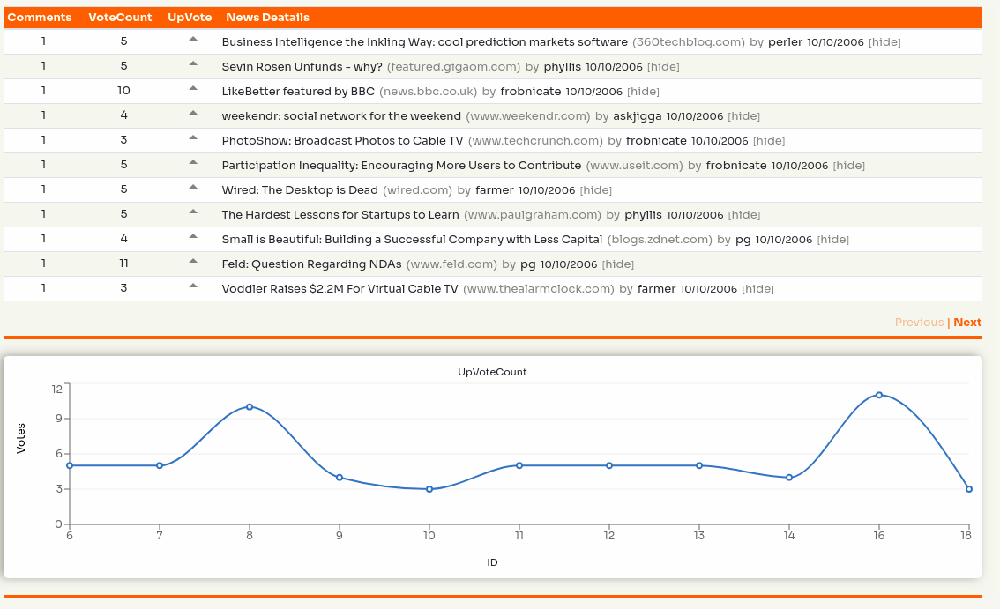

<h2 align="center">Hacker News Clone</h2>

<p align="center">
<a href="https://github.com/SAT853/hacker_news_v1/pulls/stargazers"></a> 
<a href="https://github.com/SAT853/hacker_news_v1/pulls/"></a> 
<a href="https://github.com/SAT853/hacker_news_v1/pulls/issues"></a> 
<a href="https://github.com/SAT853/hacker_news_v1/pulls/pulls"></a>
</p>

<p align="center" margin-bottom="0">
  <a href="" target="_blank">
    
  </a>
</p>
<p align="center">
  <a href="http://www.hnclone.win">Live Demo</a>
</p>

This project is a clone of hacker news rewritten with React Js and implement the server-side-rendering concepts without using Next. It is intended to get hacker news feeds by id, and instandly give vote to them.

## Overview

## Folder Structure

```
my-app/
  node_modules
  package.json
  webpack.config.server.js
  webpack-config.client.js
  README.md
  src/
    client/
      Components/
        HackerNewsFeedTabl.js
        HomeRoutes.js
        Loader.js
        Pageination.js
        Row.js
        VoteCountChart.js
      css/
        loader.css
        style.css
      redux
        actions/
            fetchDataActions.js
            types.js
        reducers/
            fetchDataReducer.js
            voteCountReducer.js
            index.js
        store.js
      utils/
        formate.js
      App.js
      index.js
      routes.js
    server/
      index.js
    views/
      layouts/
        main.handlebars
      index.handlebars
```

### Featuring

- React - (UI Framework)
- State Management - (Redux)
- Webpack - (Module Bundler)
- Node.js - (Web Server)
- Express - (Web Server Framework)
- React-Router-Dome - (Dynamic web routing)
- Jest - (Tests)
- Travis CI - (CI/CD)
- Handlebars - (Template Engine for Node )

## Installation

- `git clone git@github.com:SAT853/india-covid-19.git`
- `cd india-covid-19`
- `npm install`
- `npm start`
- Visit http://localhost:3000

## Maintainers

[SAT853](https://sat853.github.io)

## Data Source

Data source:

- [https://hn.algolia.com/api](https://hn.algolia.com/api) API for Hacker News Feed
